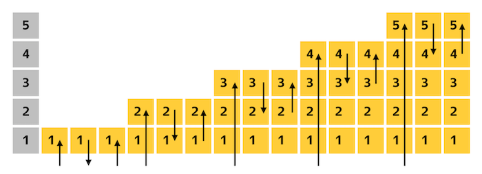

Examples how to test migrations & [Alembic](https://alembic.sqlalchemy.org/en/latest/) 
best practices ([Russian translation](README_ru.md)).

Prepared for "Databases: models, migrations, testing" lection at 
[Yandex Backend Development school](https://yandex.ru/promo/academy/backend-school/) and 
["How to develop & test database migrations with Alembic"](https://www.youtube.com/watch?v=qrlTDNaUQ-Q&feature=youtu.be&t=5862) presentation at 
[Moscow Python meetup №69](https://events.yandex.ru/events/moscow-python-meetup-30-10-2019) (videos are in Russian language).

## Stairway test
Simple and efficient method to check that migration does not have typos and 
rolls back all schema changes. Does not require maintenance - you can add this test 
to your project once and forget about it.

In particular, test detects the data types, that were previously created by `upgrade()` method 
and were not removed by `downgrade()`: when creating a table/column, Alembic automatically 
creates custom data types specified in columns (e.g. enum), but does not delete them when 
deleting table or column - developer has to do it manually.

#### How it works
Test retrieves all migrations list, and for each migration executes `upgrade`, 
`downgrade`, `upgrade` Alembic commands.
See [tests/test_stairway.py](tests/test_stairway.py) for example.

## Data-migration test
Some migrations don't just add new columns or tables, but change the data in 
some way.

In addition to checking that the migration correctly rolls back changes to the 
data structure (stairway test), you need to check that the data is correctly 
changed by the `upgrade()` method and returned to the previous state by the 
`downgrade()` method.

This test does not guarantee that there are no bugs - it is very difficult to 
provide data sets for all cases. But data-altering migrations code is 
often very complex, errors are more common, and errors in such migrations can have 
the most serious consequences.

#### How it works

The test applies all migrations up to the one being tested and adds a dataset to the database that will be modified by the migration being tested.
Then test executes the `upgrade()` method and checks that the data was changed correctly. 
After this, test calls `downgrade()` method and checks that all data was returned to its initial state.
See [tests/test_data_migrations.py](tests/test_data_migrations.py) for example.
