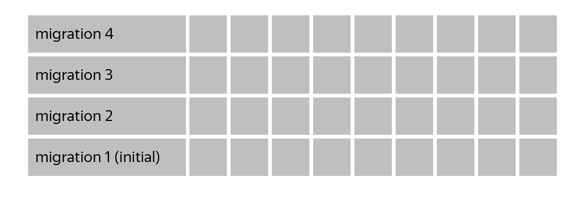

Примеры тестирования миграций и варинтов использования [Alembic](https://alembic.sqlalchemy.org/en/latest/) 
для лекции ["Базы данных: модели, миграции, тестирование"](https://habr.com/ru/company/yandex/blog/498856/#5) 
в [Школе бэкенд-разработки](https://yandex.ru/promo/academy/backend-school/) Яндекса и 
выступления ["Как писать и тестировать миграции БД с Alembic"](https://youtu.be/qrlTDNaUQ-Q?t=5650) 
на митапе [Moscow Python №69](https://events.yandex.ru/events/moscow-python-meetup-30-10-2019).

## Что внутри

Aiohttp приложение с парой миграций, с двумя командами: `staff-db` для управления состоянием базы данных (обертка вокруг Alembic) и `staff-api` (aiohttp сервис).

Чтобы развернуть приложение для разработки выполните команду `make devenv`. Она создаст виртуальное окружение в папке `./env` и установит все зависимости (выполните `make` для отображения всех доступных команд).

## Как управлять состоянием БД

Для управления состоянием БД Alembic предоставляет команду `alembic`, которая в ряде случаев имеет следующие недостатки:

* Для запуска требуется файл конфигурации `alembic.ini`, который `alembic` ищет в текущей рабочей директории. Путь к нему можно указать аргументом `--config`, но зачастую удобнее вызывать команду из любой папки без дополнительных параметров.
* Для подключения Alembic к определенной БД требуется изменять параметр `sqlalchemy.url` в `alembic.ini`. Иногда (например если приложение упаковано в Docker-контейнер) гораздо удобнее указывать БД переменной окружения и/или аргументом командной строки.
* Некоторым приложениям требуется расширять стандартные аргументы Alembic (например, чтобы поддержать работу приложения в определенной PostgreSQL схеме).  

Решить эти задачи можно с помощью [небольшой обертки над Alembic-ом](staff/db.py): например, `staff-db` позволяет указать адрес базы данных переменной окружения `STAFF_PG_URL` или аргументом `--pg-url`, рассчитывает путь до `alembic.ini` относительно своего расположения, а не текущей рабочей директории.

## Как подготовить БД для тестов

Многим тестам требуется база данных. Можно создавать новую базу для каждого теста pytest-фикстурой (см. [фикстуру postgres](tests/migrations/conftest.py#L8)), это позволит полностью изолировать тесты друг от друга.

В большинстве случаев тестам требуется уже подготовленная БД, с примененными миграциями. Так как прогонять миграции при создании БД перед каждым тестом дорого, можно сделать это один раз перед прогоном тестов, а затем создавать новые базы на основе подготовленной базы-шаблона.

Создание базы-шаблона реализовано фикстурой [`migrated_postgres_template`](tests/api/conftest.py#L10) со `scope=session`, а создание подготовленных баз - фикстурой [`migrated_postgres`](tests/api/conftest.py#L24).

## Как тестировать миграции 

### Stairway тест
Простой и эффективный метод проверить, что миграция не содержит опечаток и 
полностью откатывает внесенные изменения в структуру/типы данных. Не требует поддержки - 
достаточно добавить тест в проект один раз и забыть.

В частности, обнаруживает типы данных, созданные в методе `upgrade()` и не 
удаленные в `downgrade()`:  при создании таблиц Alembic автоматически создаст указанные в столбцах типы 
данных (например, enum), но при удалении таблиц не удалит их - это необходимо сделать вручную.

#### Принцип работы
Тест получает список всех миграций и по очереди для каждой миграции вызывает команды Alembic 
`upgrade`, `downgrade`, `upgrade`. Пример можно посмотреть в [test_stairway.py](tests/migrations/test_stairway.py).

### Data-migration тест
Некоторые миграции не просто добавляют новые столбцы или таблицы, а каким-либо 
образом изменяют данные. 

Помимо проверки, что миграция корректно откaатывает изменения струтуры данных (stairway тест) 
требуется проверить, что данные корректно изменяются методом `upgrade()` и 
возвращаются к предыдущему состоянию методом `downgrade()`.

С точки зрения разработки и поддержки этот подход дороже: для каждой миграции с данными 
необходимо разработать отдельный тест и подобрать отдельный набор данных для 
тестирования.

Такой тест не гарантирует отсутствие багов - предусмотреть наборы данных для всех 
случаев очень сложно. Но код изменяющих данные миграций часто бывает сложным, 
ошибки встречаются чаще, а ошибка в такой миграции может иметь самые серьезные последствия.

#### Принцип работы

Тест применяет все миграции до тестируемой и добавляет в базу набор данных, который будет изменен тестируемой миграцией.
Затем выполняется метод `upgrade()` и проверяется, что данные были корректно изменены. 
После этого выполняется метод `downgrade()` к предыдущей миграции и проверяется, что все данные вернулись к начальному состоянию.
Пример можно посмотреть в [test_data_migrations.py](tests/migrations/test_data_migrations.py).
